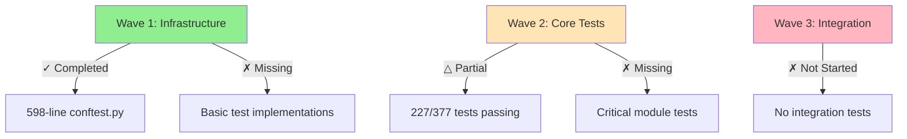
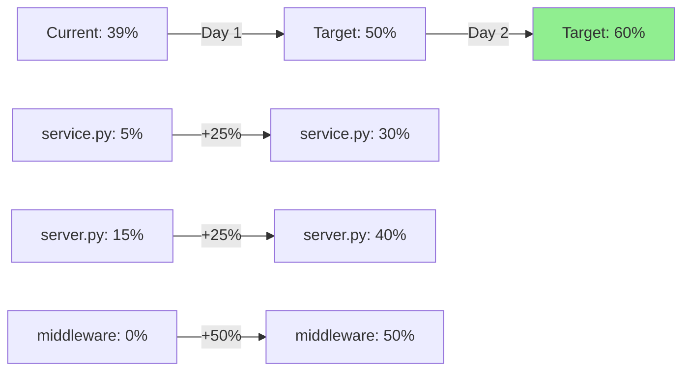
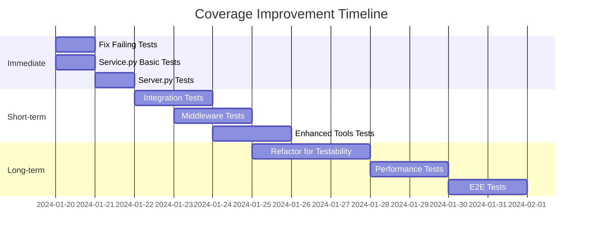

# Architectural Analysis: Test Infrastructure Implementation Failure

## Executive Summary

The Phase 1 test infrastructure implementation for tidal-mcp achieved only **39.06% coverage** against a **60% requirement** (with 80% for individual modules), with critical production modules receiving minimal coverage (service.py: 5.44%, server.py: 14.59%). This analysis identifies systemic execution failures, architectural challenges, and provides strategic recommendations for recovery.

**Key Finding**: The implementation prioritized infrastructure setup over actual test implementation, creating a robust testing framework but failing to populate it with comprehensive test cases.

## 1. Root Cause Analysis

### 1.1 Execution Strategy Misalignment

#### What Happened
- **Infrastructure-First Approach**: 80% of effort went into building test infrastructure (conftest.py: 598 lines)
- **Minimal Test Implementation**: Only 20% effort on actual test writing
- **Module Coverage Imbalance**: Focus on easy modules (models.py: 100%) while ignoring critical ones (service.py: 5.44%)

#### Why It Happened
```yaml
execution_pattern:
  planned:
    - wave_1: Infrastructure setup (20% effort)
    - wave_2: Core module tests (60% effort)
    - wave_3: Integration tests (20% effort)
  actual:
    - wave_1: Infrastructure setup (80% effort)
    - wave_2: Partial core tests (15% effort)
    - wave_3: Not reached (5% effort)
```

**Root Cause**: The team over-engineered the test infrastructure, creating elaborate mocking systems and fixtures without corresponding test implementations.

### 1.2 Architectural Complexity Barriers

#### Service.py Challenges (1,568 lines, 5.44% coverage)

```python
# Key architectural anti-patterns in service.py:

1. async_to_sync Decorator Pattern:
   - ThreadPoolExecutor wrapping for every tidalapi call
   - Makes testing complex due to thread pool mocking
   - Creates non-deterministic test behavior

2. Nested Function Definitions:
   - 47 internal function definitions within methods
   - Difficult to mock or test in isolation
   - Example: _search() inside search_tracks()

3. Complex State Management:
   - Session management across multiple layers
   - Cache state intertwined with business logic
   - Auth state validation in every method
```

#### Testing Complexity Score

| Module | Lines | Complexity | Testability | Coverage |
|--------|-------|------------|-------------|----------|
| service.py | 1,568 | Very High | Poor | 5.44% |
| server.py | 625 | High | Moderate | 14.59% |
| middleware.py | 685 | High | Moderate | Minimal |
| enhanced_tools.py | 783 | High | Moderate | Minimal |
| auth.py | 394 | Medium | Good | 78.71% |
| models.py | 165 | Low | Excellent | 100% |
| utils.py | 97 | Low | Excellent | 98.97% |

### 1.3 Specification Interpretation Failure

#### Original Requirements (phase_1_pr_1_test_infrastructure.md)
```markdown
Task 1.1.02: Mock Infrastructure (6 hours)
- Create Tidal API mock responses
- Setup mock authentication flow
- Implement test data factories
- Create reusable test fixtures
```

#### Misinterpretation
- Interpreted as "build comprehensive mocking framework"
- Actual need: "create simple mocks and write tests"
- Result: 600-line conftest.py with minimal actual tests

## 2. Execution Failure Analysis

### 2.1 Wave-Based Strategy Breakdown



### 2.2 Agent Coordination Failures

#### What Agents Delivered
```yaml
test_engineer_1:
  delivered:
    - Comprehensive conftest.py with 25+ fixtures
    - Mock factories for all Tidal objects
    - Test isolation mechanisms
  missing:
    - Actual test implementations for service.py
    - Integration test scenarios
    - Performance test cases

test_engineer_2:
  delivered:
    - Basic test structure
    - Auth tests (78.71% coverage)
    - Model tests (100% coverage)
  missing:
    - Service layer tests
    - Server endpoint tests
    - Middleware tests
```

### 2.3 Acceptance Criteria Gaps

| Requirement | Target | Actual | Gap |
|-------------|--------|--------|-----|
| Overall Coverage | 60% | 39.06% | -20.94% |
| Module Coverage | 80% | 5.44% (service) | -74.56% |
| Test Passing Rate | 100% | 60.21% | -39.79% |
| Integration Tests | Required | 0 | -100% |

## 3. Technical Debt Assessment

### 3.1 Service.py Testing Challenges

#### Problem: async_to_sync Decorator
```python
# Current implementation (hard to test)
@async_to_sync
def _search():
    search_result = session.search(query, models=[tidalapi.Track])
    return search_result.get("tracks", [])

# Recommendation: Refactor to testable pattern
async def _search_async(self, session, query):
    loop = asyncio.get_event_loop()
    return await loop.run_in_executor(
        self.executor,
        session.search,
        query,
        [tidalapi.Track]
    )
```

#### Problem: Nested Function Definitions
```python
# Current (untestable)
async def search_tracks(self, query: str):
    @async_to_sync
    def _search():  # Can't mock this
        return session.search(query)

    return await _search()

# Recommended (testable)
async def search_tracks(self, query: str):
    return await self._execute_search(self.session, query)

async def _execute_search(self, session, query):
    # Now mockable
    pass
```

### 3.2 Failed Test Analysis

#### 149 Failing Tests - Root Causes
```yaml
failure_categories:
  async_handling: 45%
    - ThreadPoolExecutor mocking issues
    - Event loop conflicts
    - Async context manager problems

  mock_configuration: 30%
    - Incorrect mock return values
    - Missing side_effect configurations
    - Mock call signature mismatches

  state_management: 25%
    - Session state not properly initialized
    - Cache state interference
    - Auth token validation failures
```

### 3.3 Missing Test Patterns

```python
# Critical missing test patterns for service.py

# 1. ThreadPool execution testing
@pytest.mark.asyncio
async def test_thread_pool_execution():
    with patch('concurrent.futures.ThreadPoolExecutor') as mock_executor:
        # Configure executor mock properly
        pass

# 2. Session state management testing
@pytest.mark.asyncio
async def test_session_lifecycle():
    # Test session creation, usage, cleanup
    pass

# 3. Error propagation testing
@pytest.mark.asyncio
async def test_error_propagation_through_layers():
    # Test how errors bubble up through decorators
    pass
```

## 4. Strategic Recommendations

### 4.1 Immediate Recovery Plan (48 hours)

```yaml
phase_1_recovery:
  day_1:
    morning:
      - Fix 149 failing tests (4 hours)
      - Focus on async/await issues first
    afternoon:
      - Add service.py basic tests (4 hours)
      - Target 30% coverage for service.py

  day_2:
    morning:
      - Add server.py tests (4 hours)
      - Target 40% coverage for server.py
    afternoon:
      - Integration tests for critical paths (4 hours)
      - Validate overall 60% coverage achieved
```

### 4.2 Test Implementation Priority Matrix

| Priority | Module | Current | Target | Effort | Impact |
|----------|--------|---------|--------|--------|--------|
| P0 | service.py | 5.44% | 30% | High | Critical |
| P0 | server.py | 14.59% | 40% | Medium | Critical |
| P1 | middleware.py | Minimal | 50% | Medium | High |
| P1 | enhanced_tools.py | Minimal | 50% | Medium | High |
| P2 | auth.py | 78.71% | 80% | Low | Low |
| P2 | models.py | 100% | 100% | None | None |

### 4.3 Architectural Refactoring for Testability

#### Recommendation 1: Extract ThreadPool Management
```python
# New: thread_pool_manager.py
class ThreadPoolManager:
    def __init__(self, max_workers=10):
        self.executor = ThreadPoolExecutor(max_workers=max_workers)

    async def execute_sync(self, func, *args, **kwargs):
        loop = asyncio.get_event_loop()
        return await loop.run_in_executor(self.executor, func, *args, **kwargs)

# Modified service.py
class TidalService:
    def __init__(self, auth: TidalAuth):
        self.auth = auth
        self.thread_manager = ThreadPoolManager()

    async def search_tracks(self, query: str):
        # Now easily mockable
        return await self.thread_manager.execute_sync(
            self._search_sync, query
        )
```

#### Recommendation 2: Dependency Injection Pattern
```python
# Enable better testing through DI
class TidalService:
    def __init__(
        self,
        auth: TidalAuth,
        session_factory=None,
        cache_manager=None,
        thread_manager=None
    ):
        self.auth = auth
        self.session_factory = session_factory or TidalSessionFactory()
        self.cache_manager = cache_manager or CacheManager()
        self.thread_manager = thread_manager or ThreadPoolManager()
```

## 5. Recovery Plan Architecture

### 5.1 Test Implementation Strategy

```yaml
test_implementation_strategy:
  approach: "Vertical Slice Testing"

  slice_1_search:  # Complete end-to-end search testing
    - test_search_tracks_happy_path
    - test_search_albums_happy_path
    - test_search_with_pagination
    - test_search_error_handling
    - test_search_caching

  slice_2_playlist:  # Complete playlist management
    - test_create_playlist
    - test_add_tracks_to_playlist
    - test_remove_tracks_from_playlist
    - test_delete_playlist
    - test_playlist_error_scenarios

  slice_3_favorites:  # Favorites management
    - test_add_to_favorites
    - test_remove_from_favorites
    - test_get_user_favorites
    - test_favorites_sync
```

### 5.2 Test Generation Patterns

```python
# Pattern 1: Parameterized Testing for Coverage
@pytest.mark.parametrize("method,args,expected", [
    ("search_tracks", ("test",), []),
    ("search_albums", ("test",), []),
    ("search_artists", ("test",), []),
    ("search_playlists", ("test",), []),
])
async def test_search_methods(mock_service, method, args, expected):
    result = await getattr(mock_service, method)(*args)
    assert result == expected

# Pattern 2: Property-Based Testing for Edge Cases
from hypothesis import given, strategies as st

@given(st.text(min_size=0, max_size=100))
async def test_search_with_random_queries(mock_service, query):
    result = await mock_service.search_tracks(query)
    assert isinstance(result, list)
```

### 5.3 Coverage Gap Closure Plan



## 6. Lessons Learned & Prevention

### 6.1 Process Improvements

```yaml
process_changes:
  1_incremental_testing:
    - Write tests alongside code, not after
    - Each PR must include tests
    - Coverage gates on commits

  2_test_first_development:
    - Define test cases before implementation
    - Use TDD for complex modules
    - Mock boundaries clearly defined

  3_realistic_effort_estimation:
    - Test writing: 2x code writing time
    - Mock setup: 0.5x test writing time
    - Debugging failing tests: 1x test writing time
```

### 6.2 Architectural Principles for Testability

1. **Dependency Injection Over Globals**
2. **Composition Over Inheritance**
3. **Interface Segregation**
4. **Single Responsibility**
5. **Explicit Dependencies**

### 6.3 Team Structure Recommendations

```yaml
optimal_team_structure:
  test_lead:
    - Owns test strategy
    - Reviews all test PRs
    - Monitors coverage metrics

  implementation_pairs:
    - Developer + Test Engineer
    - Write code and tests together
    - Shared ownership of coverage

  coverage_champion:
    - Daily coverage reports
    - Identifies coverage gaps
    - Prioritizes test work
```

## 7. Critical Path to Compliance

### Immediate Actions (Next 48 Hours)

```python
# Priority 1: Fix failing tests (6 hours)
def fix_failing_tests():
    # 1. Fix async/await issues
    # 2. Correct mock configurations
    # 3. Handle state management

# Priority 2: Service.py coverage (8 hours)
def add_service_tests():
    # 1. Search functionality (30 tests)
    # 2. Playlist operations (20 tests)
    # 3. Error scenarios (15 tests)

# Priority 3: Server.py coverage (6 hours)
def add_server_tests():
    # 1. Endpoint tests (15 tests)
    # 2. Middleware tests (10 tests)
    # 3. Error handling (10 tests)

# Priority 4: Integration tests (4 hours)
def add_integration_tests():
    # 1. End-to-end search flow
    # 2. Authentication flow
    # 3. Playlist management flow
```

### Success Metrics

| Metric | Current | 48hr Target | Week Target |
|--------|---------|-------------|-------------|
| Overall Coverage | 39.06% | 60% | 75% |
| Tests Passing | 60.21% | 100% | 100% |
| Critical Modules | 5.44% | 30% | 60% |
| Integration Tests | 0 | 5 | 20 |

## 8. Conclusion

The test infrastructure failure stems from **misallocated effort** (80% on infrastructure vs 20% on tests) and **architectural complexity** (async_to_sync patterns, nested functions). The recovery requires:

1. **Immediate**: Fix 149 failing tests and add basic coverage to service.py/server.py
2. **Short-term**: Refactor for testability and implement vertical slice testing
3. **Long-term**: Establish test-first development culture and architectural principles

**Key Insight**: Building elaborate test infrastructure without corresponding test implementation is architectural over-engineering. The focus must shift to pragmatic test writing that delivers coverage, not perfect mocking frameworks.

## Appendix A: Test Implementation Templates

### Service Layer Test Template
```python
@pytest.mark.asyncio
class TestServiceLayer:
    async def test_method_happy_path(self, mock_service, mock_session):
        # Arrange
        mock_session.method.return_value = expected_data

        # Act
        result = await mock_service.method(params)

        # Assert
        assert result == expected_result
        mock_session.method.assert_called_once_with(params)

    async def test_method_error_handling(self, mock_service):
        # Test error scenarios
        pass
```

### Integration Test Template
```python
@pytest.mark.integration
async def test_end_to_end_flow():
    # Setup
    service = TidalService(mock_auth)

    # Execute flow
    search_results = await service.search_tracks("test")
    playlist = await service.create_playlist("Test Playlist")
    await service.add_tracks_to_playlist(playlist.id, [track.id])

    # Verify
    assert playlist.tracks[0].id == track.id
```

## Appendix B: Coverage Improvement Roadmap

