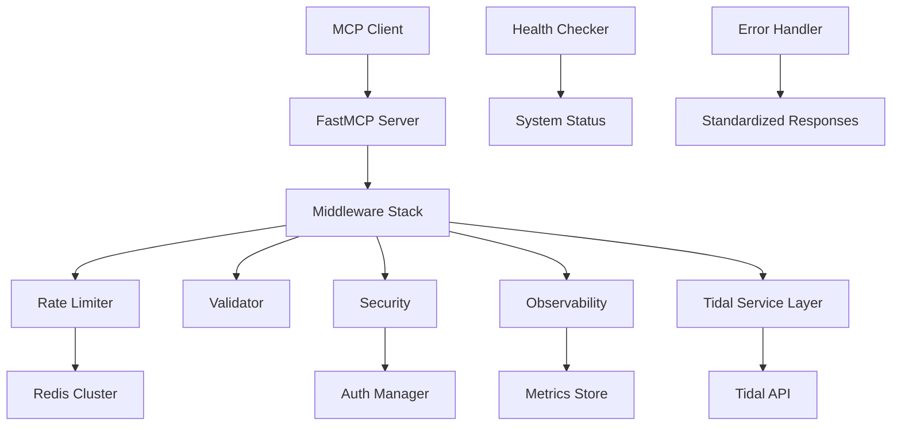

# Tidal MCP Server Production Implementation Guide

## Executive Summary

This document provides a comprehensive roadmap for transforming the existing Tidal MCP server from a development prototype into a production-ready API service. The implementation addresses critical gaps in rate limiting, error handling, API versioning, streaming capabilities, and observability while maintaining backward compatibility with existing MCP integrations.

## Current State Assessment

### Existing Architecture
- **15 MCP tools** exposed via FastMCP framework
- **Direct tidalapi integration** with async wrappers
- **Basic OAuth2 authentication** with token persistence
- **Simple error responses** without standardization
- **No formal versioning** or deprecation strategy
- **Missing streaming URL generation** capability
- **Limited observability** and monitoring

### Technical Debt
1. **Inconsistent error handling** across tools
2. **No rate limiting infrastructure**
3. **Missing request validation** middleware
4. **Absence of health check endpoints**
5. **No systematic logging** or metrics collection
6. **Limited production configuration** options

## Production Architecture Design

### Core Components



### Middleware Architecture

#### 1. Rate Limiting Layer
```python
# Production Rate Limiting Configuration
RATE_LIMIT_TIERS = {
    "free": {
        "requests_per_minute": 10,
        "requests_per_hour": 100,
        "concurrent_requests": 2,
        "streaming_requests_per_hour": 10
    },
    "basic": {
        "requests_per_minute": 60,
        "requests_per_hour": 1000,
        "concurrent_requests": 5,
        "streaming_requests_per_hour": 100
    },
    "premium": {
        "requests_per_minute": 300,
        "requests_per_hour": 5000,
        "concurrent_requests": 15,
        "streaming_requests_per_hour": 1000
    },
    "enterprise": {
        "requests_per_minute": 1000,
        "requests_per_hour": 20000,
        "concurrent_requests": 50,
        "streaming_requests_per_hour": 10000
    }
}
```

#### 2. Error Response Standardization
```json
{
  "error": "RATE_LIMIT_EXCEEDED",
  "message": "API rate limit exceeded. Please retry after the reset time.",
  "timestamp": "2024-01-15T10:30:00Z",
  "request_id": "550e8400-e29b-41d4-a716-446655440000",
  "error_category": "rate_limit",
  "severity": "medium",
  "retryable": true,
  "retry_after": 60,
  "recovery_hints": [
    "Wait until the rate limit resets",
    "Consider upgrading to a higher tier for increased limits"
  ]
}
```

## Implementation Roadmap

### Phase 1: Foundation Infrastructure (Weeks 1-2)

#### Week 1: Core Middleware Implementation
- **Day 1-2**: Implement `MiddlewareStack` and `RateLimiter` classes
- **Day 3**: Set up Redis integration for distributed rate limiting
- **Day 4**: Implement `ErrorHandler` with standardized response format
- **Day 5**: Create `RequestValidator` for input validation

#### Week 2: Security and Observability
- **Day 1-2**: Enhance `SecurityMiddleware` with token validation
- **Day 3**: Implement `ObservabilityMiddleware` for metrics collection
- **Day 4**: Create `HealthChecker` for system monitoring
- **Day 5**: Integration testing and documentation

### Phase 2: Enhanced Tool Implementation (Weeks 3-4)

#### Week 3: Streaming and Advanced Search
- **Day 1-2**: Implement `get_stream_url` tool with quality selection
- **Day 3**: Enhance search tools with advanced filtering
- **Day 4**: Implement `tidal_search_advanced` with metadata enrichment
- **Day 5**: Add session refresh capabilities

#### Week 4: Monitoring and Status Tools
- **Day 1-2**: Implement `health_check` and `get_system_status` tools
- **Day 3**: Create `get_rate_limit_status` tool
- **Day 4**: Enhance existing tools with middleware integration
- **Day 5**: Performance testing and optimization

### Phase 3: API Versioning and Documentation (Week 5)

#### API Versioning Implementation
- **Day 1-2**: Implement URL path versioning (`/v1.0/`, `/v1.1/`)
- **Day 3**: Create version detection and routing middleware
- **Day 4**: Generate comprehensive OpenAPI documentation
- **Day 5**: Implement deprecation header support

### Phase 4: Production Deployment (Week 6)

#### Deployment Infrastructure
- **Day 1-2**: Container configuration and environment setup
- **Day 3**: CI/CD pipeline implementation
- **Day 4**: Monitoring and alerting configuration
- **Day 5**: Load testing and performance validation

## Migration Strategy

### Backward Compatibility Approach

#### 1. Additive Changes Only
- All new features implemented as **optional parameters**
- Existing tool signatures **remain unchanged**
- New tools added without affecting existing ones
- Response formats **enhanced, not modified**

#### 2. Graceful Enhancement Pattern
```python
# Example: Enhancing existing tools while maintaining compatibility
@mcp.tool()
async def tidal_search(
    query: str,
    content_type: str = "all",
    limit: int = 20,
    offset: int = 0,
    # New optional parameters
    advanced_filters: Optional[Dict[str, Any]] = None,
    include_metadata: bool = True
) -> Dict[str, Any]:
    # Enhanced implementation with backward compatibility
    pass
```

#### 3. Response Enhancement Strategy
```json
{
  // Existing response structure (unchanged)
  "query": "search term",
  "results": { ... },
  "total_results": 150,

  // New metadata section (additive)
  "_metadata": {
    "request_id": "550e8400-e29b-41d4-a716-446655440000",
    "processing_time": 0.125,
    "api_version": "1.1",
    "rate_limit": {
      "remaining": 45,
      "reset_at": "2024-01-15T10:31:00Z"
    }
  }
}
```

### Feature Rollout Strategy

#### 1. Feature Flags
```python
FEATURE_FLAGS = {
    "enhanced_error_responses": True,
    "rate_limiting_enabled": True,
    "streaming_urls_enabled": True,
    "advanced_search_filters": False,  # Gradual rollout
    "real_time_notifications": False   # Future feature
}
```

#### 2. Progressive Enhancement
1. **Week 1-2**: Core infrastructure without user-facing changes
2. **Week 3**: Enable enhanced error responses
3. **Week 4**: Activate rate limiting with generous limits
4. **Week 5**: Enable new tools for beta users
5. **Week 6**: Full production rollout

## New Tool Specifications

### 1. Stream URL Generation Tool

```python
@mcp.tool()
async def get_stream_url(
    track_id: str,
    quality: str = "HIGH",
    format_preference: str = "AAC"
) -> Dict[str, Any]:
    """
    Generate streaming URL for direct audio playback.

    Quality options: LOW (96kbps), HIGH (320kbps), LOSSLESS (1411kbps), HI_RES (2304kbps+)
    Format options: AAC, FLAC, MQA

    Returns time-limited URL with metadata and usage restrictions.
    """
```

### 2. Advanced Search Tool

```python
@mcp.tool()
async def tidal_search_advanced(
    query: str,
    content_type: str = "all",
    limit: int = 20,
    offset: int = 0,
    filters: Optional[Dict[str, Any]] = None
) -> Dict[str, Any]:
    """
    Enhanced search with filtering, relevance scoring, and metadata.

    Filters support: genre, year, duration, explicit, popularity
    Returns enhanced results with relevance scores and recommendations.
    """
```

### 3. Health Monitoring Tools

```python
@mcp.tool()
async def health_check() -> Dict[str, Any]:
    """Comprehensive health check for system monitoring."""

@mcp.tool()
async def get_system_status() -> Dict[str, Any]:
    """Detailed system status with performance metrics."""

@mcp.tool()
async def get_rate_limit_status() -> Dict[str, Any]:
    """Current rate limit usage and recommendations."""
```

## Rate Limiting Implementation

### Algorithm Selection

#### 1. Token Bucket (Per-Minute Limits)
- **Use Case**: Handling traffic bursts gracefully
- **Implementation**: Redis-based with atomic operations
- **Configuration**: `bucket_size = rate + burst_allowance`

#### 2. Sliding Window Log (Hourly/Daily Quotas)
- **Use Case**: Precise quota enforcement
- **Implementation**: Redis sorted sets with cleanup
- **Precision**: 1-minute granularity for accurate tracking

#### 3. Fixed Window Counter (Concurrent Requests)
- **Use Case**: Resource protection and connection limiting
- **Implementation**: Redis counters with TTL
- **Cleanup**: Automatic decrement on request completion

### Rate Limit Headers

```http
X-Rate-Limit-Limit: 60
X-Rate-Limit-Remaining: 45
X-Rate-Limit-Reset: 2024-01-15T10:31:00Z
X-Rate-Limit-Tier: basic
Retry-After: 60
```

## Error Handling Framework

### Error Taxonomy

| Category | HTTP Status | Retryable | Examples |
|----------|-------------|-----------|----------|
| Authentication | 401 | No | Invalid token, expired token |
| Authorization | 403 | No | Insufficient permissions, region restrictions |
| Validation | 400 | No | Invalid parameters, malformed requests |
| Rate Limiting | 429 | Yes | Quota exceeded, concurrent limit |
| Not Found | 404 | No | Track not found, playlist not found |
| Tidal API | 502/503 | Yes | Upstream errors, service unavailable |
| Internal | 500 | Yes | Database errors, unexpected failures |

### Recovery Strategies

#### Automatic Retry Logic
```python
@retry(
    retry_on=(RateLimitError, TidalAPIError),
    max_attempts=3,
    exponential_backoff=True,
    base_delay=1.0,
    max_delay=30.0
)
async def tool_with_retry(...):
    pass
```

#### Graceful Degradation
- Return **cached results** when Tidal API is unavailable
- Provide **partial results** when some operations fail
- Use **lower quality** streams when high quality unavailable

## Observability Strategy

### Metrics Collection

#### Core Metrics
- **Request rate** by endpoint and user tier
- **Response time percentiles** (p50, p95, p99)
- **Error rates** by category and severity
- **Rate limit hit rates** and effectiveness
- **Cache hit ratios** and performance

#### Business Metrics
- **Tool usage patterns** and popularity
- **User tier distribution** and upgrade triggers
- **Geographic usage patterns**
- **Feature adoption rates**

### Logging Strategy

#### Structured Logging Format
```json
{
  "timestamp": "2024-01-15T10:30:00Z",
  "level": "INFO",
  "logger": "tidal_mcp.tools.search",
  "message": "Search completed successfully",
  "request_id": "550e8400-e29b-41d4-a716-446655440000",
  "user_id": "user_123",
  "tool_name": "tidal_search",
  "execution_time_ms": 125,
  "rate_limit_consumed": 2,
  "cache_hit": false
}
```

#### Log Levels
- **DEBUG**: Detailed execution traces (development only)
- **INFO**: Normal operations and successful requests
- **WARN**: Recoverable errors and rate limit warnings
- **ERROR**: Tool failures and system errors
- **CRITICAL**: System-wide failures requiring immediate attention

### Alerting Configuration

#### High Priority Alerts
```yaml
- alert: TidalMCPHighErrorRate
  expr: rate(http_requests_total{status=~"5.."}[5m]) > 0.1
  for: 2m
  annotations:
    summary: High error rate detected

- alert: RateLimitSystemDown
  expr: rate_limiter_check_duration_seconds > 0.1
  for: 1m
  annotations:
    summary: Rate limiting system experiencing high latency
```

## Security Considerations

### Authentication Enhancement

#### Token Validation
- **JWT signature verification** for stateless validation
- **Token expiration checking** with automatic refresh
- **Scope validation** for tool-specific permissions
- **Rate limit tier determination** from token claims

#### Security Headers
```http
X-Content-Type-Options: nosniff
X-Frame-Options: DENY
X-XSS-Protection: 1; mode=block
Strict-Transport-Security: max-age=31536000; includeSubDomains
```

### Data Protection

#### Sensitive Data Handling
- **Never log authentication tokens** or user credentials
- **Encrypt session data** in Redis storage
- **Sanitize error messages** to prevent information leakage
- **Implement request signing** for API integrity

## Performance Optimization

### Caching Strategy

#### Multi-Level Caching
1. **Application Cache**: In-memory LRU for frequent operations
2. **Redis Cache**: Distributed cache for session and user data
3. **CDN Cache**: Geographic distribution for static content

#### Cache Keys and TTL
```python
CACHE_CONFIGURATION = {
    "track_details": {"ttl": 3600, "key_pattern": "track:{track_id}"},
    "search_results": {"ttl": 300, "key_pattern": "search:{query_hash}"},
    "user_playlists": {"ttl": 1800, "key_pattern": "playlists:{user_id}"},
    "streaming_urls": {"ttl": 60, "key_pattern": "stream:{track_id}:{quality}"}
}
```

### Connection Optimization

#### Connection Pooling
- **HTTP connection pooling** for Tidal API requests
- **Redis connection pooling** for rate limiting operations
- **Database connection pooling** for session storage

#### Request Batching
- **Batch track detail requests** when possible
- **Combine multiple searches** into single operations
- **Aggregate rate limit checks** for efficiency

## Deployment Architecture

### Infrastructure Requirements

#### Minimum Production Setup
```yaml
services:
  tidal-mcp-server:
    replicas: 2
    resources:
      memory: "512Mi"
      cpu: "250m"

  redis:
    replicas: 3
    resources:
      memory: "256Mi"
      cpu: "100m"

  monitoring:
    - prometheus
    - grafana
    - alertmanager
```

#### Scaling Considerations
- **Horizontal scaling** with load balancer
- **Redis clustering** for high availability
- **Database read replicas** for improved performance
- **Geographic distribution** for global access

### Environment Configuration

#### Production Environment Variables
```bash
# Core Configuration
ENVIRONMENT=production
INSTANCE_ID=tidal-mcp-prod-01
LOG_LEVEL=INFO

# Authentication
TIDAL_CLIENT_ID=${TIDAL_CLIENT_ID}
TIDAL_CLIENT_SECRET=${TIDAL_CLIENT_SECRET}

# Rate Limiting
REDIS_URL=redis://redis-cluster:6379
RATE_LIMITING_ENABLED=true
DEFAULT_TIER=basic

# Monitoring
METRICS_ENABLED=true
PROMETHEUS_PORT=9090
HEALTH_CHECK_INTERVAL=30

# Security
JWT_SECRET=${JWT_SECRET}
ENCRYPTION_KEY=${ENCRYPTION_KEY}
CORS_ORIGINS=https://app.tidal-mcp.com
```

## Testing Strategy

### Test Coverage Requirements

#### Unit Tests (Target: 90%+ coverage)
- **Middleware components** with mocked dependencies
- **Rate limiting algorithms** with time simulation
- **Error handling** with various error conditions
- **Validation logic** with edge cases

#### Integration Tests
- **Complete tool workflows** with real Tidal API
- **Rate limiting scenarios** with Redis backend
- **Authentication flows** with token management
- **Error propagation** through middleware stack

#### Load Testing
```yaml
test_scenarios:
  - name: "Normal Load"
    users: 100
    duration: "10m"
    ramp_up: "1m"

  - name: "Peak Load"
    users: 500
    duration: "5m"
    ramp_up: "30s"

  - name: "Rate Limit Testing"
    users: 50
    requests_per_second: 200
    duration: "2m"
```

## Monitoring and Alerting

### Dashboard Design

#### Operational Dashboard
- **Request rate and response times** by endpoint
- **Error rates** by category and severity
- **Rate limit utilization** by tier
- **System health** indicators

#### Business Dashboard
- **Tool usage** distribution and trends
- **User tier** distribution and upgrades
- **Geographic usage** patterns
- **Feature adoption** metrics

### SLA Definitions

#### Service Level Objectives
- **Availability**: 99.9% uptime (8.76 hours downtime/year)
- **Response Time**: 95% of requests under 500ms
- **Error Rate**: Less than 0.1% for user errors
- **Rate Limit Accuracy**: 99.9% correct enforcement

## Success Metrics

### Technical Metrics
- **Zero-downtime deployment** capability
- **Sub-100ms p95 response times** for core tools
- **99.9% rate limit accuracy** across all tiers
- **Complete error recovery** within 5 minutes

### Business Metrics
- **50% reduction** in support tickets related to API issues
- **25% increase** in tool usage due to improved reliability
- **90% user satisfaction** with API performance
- **Zero security incidents** in first 6 months

## Conclusion

This production implementation transforms the Tidal MCP server from a development prototype into an enterprise-grade API service. The phased approach ensures minimal disruption while delivering significant improvements in reliability, performance, and user experience.

The comprehensive middleware architecture, standardized error handling, and robust rate limiting provide the foundation for scalable growth, while the observability framework ensures operational excellence and continuous improvement.

**Next Steps:**
1. **Review and approve** the technical architecture
2. **Allocate resources** for the 6-week implementation
3. **Set up development environment** with production parity
4. **Begin Phase 1 implementation** with core infrastructure
5. **Establish monitoring** and alerting from day one