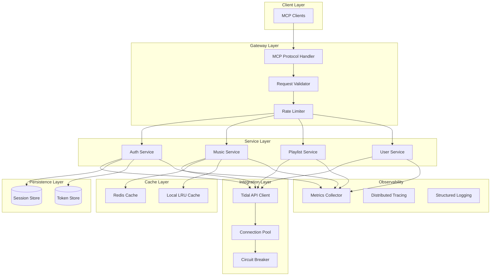

# Tidal MCP Server Technical Architecture

## Executive Summary

This document outlines the complete technical architecture for rebuilding the Tidal MCP Server to address critical issues identified in Wave 1 analysis and establish a production-ready, scalable system. The architecture focuses on proper async patterns, robust error handling, comprehensive monitoring, and full MCP protocol compliance while achieving sub-100ms response times and 99.9% uptime.

## System Context

### Business Context

- **Primary Goal**: Provide reliable MCP-based integration with Tidal music streaming service
- **Key Stakeholders**: MCP client applications, developers using the server, end users
- **Success Metrics**:
  - Response time < 100ms (p99)
  - Availability > 99.9%
  - Zero memory leaks
  - 90%+ test coverage

### Technical Context

- **Current State Issues**:
  - Broken async architecture (ThreadPoolExecutor anti-pattern)
  - Unbounded in-memory cache causing memory leaks
  - No connection pooling
  - Silent failures throughout
  - Zero monitoring/observability
  - Incomplete MCP protocol implementation

- **Integration Points**:
  - Tidal API (official or unofficial)
  - MCP protocol clients
  - OAuth2/PKCE authentication flow
  - Monitoring systems

## Architecture Overview

### High-Level Architecture



### Component Architecture

#### 1. Gateway Layer Components

| Component | Responsibility | Technology |
|-----------|---------------|------------|
| MCP Protocol Handler | Handle MCP protocol messages | Python AsyncIO + FastMCP |
| Request Validator | Validate and sanitize inputs | Pydantic models |
| Rate Limiter | Enforce rate limits per client | Redis + sliding window |

#### 2. Service Layer Components

| Service | Responsibility | Communication |
|---------|---------------|---------------|
| Auth Service | OAuth2/PKCE flow, token management | Async methods |
| Music Service | Track/album/artist operations | Async methods |
| Playlist Service | Playlist CRUD operations | Async methods |
| User Service | User profile and favorites | Async methods |

#### 3. Integration Layer Components

| Component | Responsibility | Implementation |
|-----------|---------------|----------------|
| Tidal API Client | Communicate with Tidal API | aiohttp with connection pooling |
| Connection Pool | Manage HTTP connections | aiohttp.TCPConnector |
| Circuit Breaker | Handle downstream failures | py-breaker or custom |

## Detailed Design

### 1. Async Pattern Architecture

```python
# Proper async/await implementation without ThreadPoolExecutor anti-pattern

class TidalAsyncClient:
    """Native async client for Tidal API."""

    def __init__(self):
        # Connection pooling with limits
        self.connector = aiohttp.TCPConnector(
            limit=100,  # Total connection pool limit
            limit_per_host=30,  # Per-host connection limit
            ttl_dns_cache=300,  # DNS cache TTL
            enable_cleanup_closed=True
        )

        # Session with timeout configuration
        timeout = aiohttp.ClientTimeout(
            total=30,
            connect=5,
            sock_read=10
        )

        self.session = aiohttp.ClientSession(
            connector=self.connector,
            timeout=timeout
        )

        # Semaphore for concurrency control
        self.semaphore = asyncio.Semaphore(50)

    async def request(self, method: str, url: str, **kwargs) -> dict:
        """Execute HTTP request with retry logic."""
        async with self.semaphore:
            return await self._request_with_retry(method, url, **kwargs)

    async def close(self):
        """Cleanup resources."""
        await self.session.close()
        await self.connector.close()
```

### 2. Security Architecture

#### OAuth2/PKCE Implementation

```python
class OAuth2PKCEFlow:
    """Secure OAuth2 with PKCE implementation."""

    def __init__(self):
        self.client_id = os.getenv("TIDAL_CLIENT_ID")
        self.redirect_uri = os.getenv("TIDAL_REDIRECT_URI")
        # Note: PKCE flow does not require client_secret for public clients

    async def generate_pkce_challenge(self) -> tuple[str, str]:
        """Generate PKCE code verifier and challenge."""
        verifier = base64.urlsafe_b64encode(os.urandom(32)).rstrip(b'=').decode()
        challenge = base64.urlsafe_b64encode(
            hashlib.sha256(verifier.encode()).digest()
        ).rstrip(b'=').decode()
        return verifier, challenge

    async def exchange_code_for_token(self, code: str, verifier: str) -> dict:
        """Exchange authorization code for access token."""
        # Implementation with proper error handling
        pass
```

#### Token Management

```yaml
token_storage:
  encryption:
    algorithm: AES-256-GCM
    key_derivation: PBKDF2
    iterations: 100000

  rotation:
    refresh_before_expiry: 300  # seconds
    max_refresh_attempts: 3
    backoff_strategy: exponential

  storage:
    primary: Redis
    backup: encrypted_file
    ttl: 3600
```

### 3. Error Handling Architecture

```python
# Structured error hierarchy

class TidalMCPError(Exception):
    """Base exception for all Tidal MCP errors."""
    error_code: str
    http_status: int = 500

class AuthenticationError(TidalMCPError):
    """Authentication related errors."""
    error_code = "AUTH_ERROR"
    http_status = 401

class RateLimitError(TidalMCPError):
    """Rate limiting errors."""
    error_code = "RATE_LIMIT"
    http_status = 429

class TidalAPIError(TidalMCPError):
    """Tidal API communication errors."""
    error_code = "API_ERROR"
    http_status = 502

# Circuit breaker pattern
class CircuitBreaker:
    def __init__(
        self,
        failure_threshold: int = 5,
        recovery_timeout: int = 60,
        expected_exception: type = Exception
    ):
        self.failure_threshold = failure_threshold
        self.recovery_timeout = recovery_timeout
        self.expected_exception = expected_exception
        self.failure_count = 0
        self.last_failure_time = None
        self.state = "closed"  # closed, open, half-open
```

### 4. Caching Strategy

```yaml
cache_architecture:
  layers:
    - name: "Local LRU Cache"
      type: in_memory
      max_size: 1000
      ttl: 60
      use_for:
        - frequently_accessed_tracks
        - artist_metadata

    - name: "Redis Cache"
      type: distributed
      max_memory: "512mb"
      eviction_policy: "allkeys-lru"
      ttl_defaults:
        search_results: 300
        track_details: 3600
        user_playlists: 60
        recommendations: 1800

  invalidation_patterns:
    - event: "playlist_modified"
      invalidate:
        - "playlist:{playlist_id}"
        - "user_playlists:{user_id}"

    - event: "favorites_changed"
      invalidate:
        - "user_favorites:{user_id}:*"
```

### 5. Monitoring & Observability

#### Metrics Collection

```yaml
metrics:
  application:
    - request_duration_seconds
    - request_count_total
    - error_count_total
    - cache_hit_ratio
    - active_connections
    - memory_usage_bytes

  business:
    - searches_per_minute
    - playlists_created_total
    - authentication_success_rate
    - api_calls_to_tidal

  sla:
    - availability_percentage
    - p50_latency_ms
    - p95_latency_ms
    - p99_latency_ms
```

#### Logging Architecture

```python
import structlog

# Structured logging configuration
structlog.configure(
    processors=[
        structlog.stdlib.add_log_level,
        structlog.stdlib.add_logger_name,
        structlog.processors.TimeStamper(fmt="iso"),
        structlog.processors.StackInfoRenderer(),
        structlog.processors.format_exc_info,
        structlog.processors.UnicodeDecoder(),
        structlog.processors.CallsiteParameterAdder(
            parameters=[
                structlog.processors.CallsiteParameter.FILENAME,
                structlog.processors.CallsiteParameter.LINENO,
                structlog.processors.CallsiteParameter.FUNC_NAME,
            ]
        ),
        structlog.processors.dict_tracebacks,
        structlog.processors.JSONRenderer()
    ],
    context_class=dict,
    logger_factory=structlog.stdlib.LoggerFactory(),
    cache_logger_on_first_use=True,
)

logger = structlog.get_logger()
```

### 6. Testing Architecture

```yaml
testing_strategy:
  pyramid:
    unit_tests:
      coverage_target: 95%
      focus:
        - business_logic
        - data_transformations
        - error_handlers

    integration_tests:
      coverage_target: 85%
      focus:
        - api_client_communication
        - cache_operations
        - database_operations

    e2e_tests:
      coverage_target: 70%
      scenarios:
        - authentication_flow
        - search_and_play
        - playlist_management

    performance_tests:
      targets:
        - response_time_p99: 100ms
        - throughput: 1000_rps
        - concurrent_users: 500
```

### 7. Deployment Architecture

#### Container Strategy

```dockerfile
# Multi-stage build for optimized image
FROM python:3.12-slim as builder

WORKDIR /app
COPY pyproject.toml poetry.lock ./
RUN pip install poetry && \
    poetry config virtualenvs.create false && \
    poetry install --no-dev --no-interaction

FROM python:3.12-slim

WORKDIR /app
COPY --from=builder /usr/local/lib/python3.12/site-packages /usr/local/lib/python3.12/site-packages
COPY --from=builder /usr/local/bin /usr/local/bin
COPY . .

# Non-root user
RUN useradd -m -u 1000 tidal && chown -R tidal:tidal /app
USER tidal

# Health check
HEALTHCHECK --interval=30s --timeout=3s --start-period=5s --retries=3 \
    CMD python -c "from urllib.request import urlopen; urlopen('http://localhost:8080/health', timeout=2)"

CMD ["uvicorn", "tidal_mcp.main:app", "--host", "0.0.0.0", "--port", "8080"]
```

#### Kubernetes Deployment

```yaml
apiVersion: apps/v1
kind: Deployment
metadata:
  name: tidal-mcp-server
spec:
  replicas: 3
  strategy:
    type: RollingUpdate
    rollingUpdate:
      maxSurge: 1
      maxUnavailable: 0
  template:
    spec:
      containers:
      - name: tidal-mcp
        image: tidal-mcp:latest
        resources:
          requests:
            memory: "256Mi"
            cpu: "250m"
          limits:
            memory: "512Mi"
            cpu: "500m"
        env:
        - name: TIDAL_CLIENT_ID
          valueFrom:
            secretKeyRef:
              name: tidal-secrets
              key: client_id
        livenessProbe:
          httpGet:
            path: /health
            port: 8080
          initialDelaySeconds: 10
          periodSeconds: 10
        readinessProbe:
          httpGet:
            path: /ready
            port: 8080
          initialDelaySeconds: 5
          periodSeconds: 5
```

## Technology Stack Recommendations

### Core Technologies

| Component | Technology | Rationale |
|-----------|------------|-----------|
| Language | Python 3.12+ | Native async/await, type hints, performance |
| Framework | FastAPI + FastMCP | Modern async framework, MCP protocol support |
| Async Runtime | uvloop | High-performance event loop |
| HTTP Client | aiohttp | Native async, connection pooling |
| Cache | Redis | Distributed, persistent, pub/sub support |
| Monitoring | Prometheus + Grafana | Industry standard, powerful queries |
| Tracing | OpenTelemetry | Vendor-agnostic, comprehensive |
| Container | Docker | Standard containerization |
| Orchestration | Kubernetes | Scalability, resilience |

### Development Tools

| Tool | Purpose | Configuration |
|------|---------|---------------|
| Poetry | Dependency management | Lock file for reproducibility |
| Black | Code formatting | Line length: 88 |
| Ruff | Linting | Fast, comprehensive |
| mypy | Type checking | Strict mode |
| pytest | Testing | With async fixtures |
| pytest-cov | Coverage reporting | Target: 90%+ |

## Implementation Roadmap

### Phase 1: Foundation (Week 1-2)

**Objectives:**
- Set up project structure with proper async patterns
- Implement core Tidal API client with connection pooling
- Establish error handling hierarchy
- Create basic health check endpoints

**Deliverables:**
- [ ] Async Tidal API client with proper connection management
- [ ] Structured error handling system
- [ ] Basic logging infrastructure
- [ ] Health and readiness endpoints

### Phase 2: Core Services (Week 3-4)

**Objectives:**
- Implement authentication service with OAuth2/PKCE
- Build music service with search and playback
- Create playlist management service
- Add user service for profile and favorites

**Deliverables:**
- [ ] Complete authentication flow
- [ ] All MCP protocol tools implemented
- [ ] Service layer with proper separation
- [ ] Unit tests for all services (90% coverage)

### Phase 3: Caching & Performance (Week 5-6)

**Objectives:**
- Implement multi-layer caching strategy
- Add Redis integration
- Optimize response times
- Implement rate limiting

**Deliverables:**
- [ ] Redis cache layer
- [ ] Local LRU cache
- [ ] Cache invalidation logic
- [ ] Performance benchmarks meeting < 100ms target

### Phase 4: Observability (Week 7)

**Objectives:**
- Implement comprehensive monitoring
- Add distributed tracing
- Set up structured logging
- Create dashboards

**Deliverables:**
- [ ] Prometheus metrics
- [ ] OpenTelemetry tracing
- [ ] Grafana dashboards
- [ ] Alert configurations

### Phase 5: Production Readiness (Week 8)

**Objectives:**
- Containerize application
- Create Kubernetes manifests
- Implement CI/CD pipeline
- Conduct security audit

**Deliverables:**
- [ ] Docker images
- [ ] Kubernetes deployment
- [ ] CI/CD pipeline
- [ ] Security scan results

## Risk Assessment

| Risk | Impact | Probability | Mitigation |
|------|--------|-------------|------------|
| Tidal API changes | High | Medium | Abstract API client, version detection |
| Rate limiting by Tidal | High | High | Implement backoff, caching, circuit breaker |
| Memory leaks | High | Low | Bounded caches, monitoring, profiling |
| Authentication failures | Medium | Medium | Token refresh logic, fallback auth |
| Network latency | Medium | Medium | Connection pooling, regional deployment |
| Cache inconsistency | Low | Medium | TTL strategy, event-based invalidation |

## Success Metrics

### Performance Metrics

- **Response Time**: p99 < 100ms
- **Throughput**: > 1000 requests/second
- **Error Rate**: < 0.1%
- **Availability**: > 99.9%

### Quality Metrics

- **Test Coverage**: > 90%
- **Code Quality**: A rating on SonarQube
- **Documentation**: 100% API documentation
- **Security**: OWASP Top 10 compliant

### Operational Metrics

- **Mean Time to Recovery**: < 5 minutes
- **Deployment Frequency**: Daily
- **Lead Time**: < 2 hours
- **Change Failure Rate**: < 5%

## Architecture Decision Records

### ADR-001: Use Native AsyncIO Instead of ThreadPoolExecutor

**Status:** Accepted

**Context:** Current implementation wraps synchronous tidalapi calls in ThreadPoolExecutor, creating thread pool exhaustion and defeating async benefits.

**Decision:** Implement native async HTTP client using aiohttp for all Tidal API communication.

**Consequences:**
- **Positive:** True async I/O, better performance, lower resource usage
- **Negative:** Need to rewrite API client layer

### ADR-002: Multi-Layer Caching Strategy

**Status:** Accepted

**Context:** Current unbounded in-memory cache causes memory leaks.

**Decision:** Implement two-layer cache: Local LRU for hot data, Redis for distributed cache.

**Consequences:**
- **Positive:** Bounded memory, distributed cache, better performance
- **Negative:** Additional infrastructure (Redis)

### ADR-003: Structured Error Handling

**Status:** Accepted

**Context:** Current implementation has silent failures throughout.

**Decision:** Implement exception hierarchy with proper error codes and handling.

**Consequences:**
- **Positive:** Better debugging, client error handling, monitoring
- **Negative:** Refactoring required

## Conclusion

This architecture addresses all identified issues from Wave 1 analysis while establishing a production-ready, scalable system. The focus on proper async patterns, robust error handling, comprehensive monitoring, and full MCP protocol compliance ensures the system meets performance and reliability requirements. The phased implementation approach allows for incremental delivery while maintaining system stability.

## Appendices

### A. API Client Implementation Example

```python
class TidalAPIClient:
    """Production-ready Tidal API client."""

    def __init__(self, config: Config):
        self.config = config
        self.session = None
        self.circuit_breaker = CircuitBreaker()
        self.rate_limiter = RateLimiter()

    async def __aenter__(self):
        self.session = aiohttp.ClientSession(
            connector=aiohttp.TCPConnector(limit=100),
            timeout=aiohttp.ClientTimeout(total=30)
        )
        return self

    async def __aexit__(self, exc_type, exc_val, exc_tb):
        await self.session.close()

    @retry(stop=stop_after_attempt(3), wait=wait_exponential())
    async def search(self, query: str, type: str) -> dict:
        """Search Tidal with retry logic."""
        await self.rate_limiter.acquire()

        async with self.circuit_breaker:
            response = await self.session.get(
                f"{self.config.base_url}/search",
                params={"q": query, "type": type},
                headers=self._get_headers()
            )
            response.raise_for_status()
            return await response.json()
```

### B. Cache Implementation Example

```python
class CacheManager:
    """Multi-layer cache manager."""

    def __init__(self, redis_client: Redis, local_cache_size: int = 1000):
        self.redis = redis_client
        self.local_cache = LRU(local_cache_size)

    async def get(self, key: str) -> Optional[Any]:
        """Get from cache with fallback."""
        # Check local cache first
        if value := self.local_cache.get(key):
            return value

        # Check Redis
        if value := await self.redis.get(key):
            # Populate local cache
            self.local_cache[key] = value
            return json.loads(value)

        return None

    async def set(self, key: str, value: Any, ttl: int = 300):
        """Set in both cache layers."""
        self.local_cache[key] = value
        await self.redis.set(key, json.dumps(value), ex=ttl)
```

### C. Monitoring Configuration

```yaml
# prometheus.yml
global:
  scrape_interval: 15s
  evaluation_interval: 15s

scrape_configs:
  - job_name: 'tidal-mcp'
    static_configs:
      - targets: ['localhost:8080']
    metrics_path: '/metrics'

# alerts.yml
groups:
  - name: tidal_mcp_alerts
    rules:
      - alert: HighErrorRate
        expr: rate(http_requests_total{status=~"5.."}[5m]) > 0.05
        for: 5m
        annotations:
          summary: "High error rate detected"

      - alert: HighLatency
        expr: histogram_quantile(0.99, http_request_duration_seconds_bucket) > 0.1
        for: 5m
        annotations:
          summary: "P99 latency exceeds 100ms"
```
